     

[Installation](#Installation) | [Syntax](#Syntax) | [Examples](#Examples) | [Feedback](#Feedback) | [Change log](#Change-log)

---


# clipgeo v2.1
(14 May 2024)

This package is a collection of three commands:


|Package|Version|Description|
|----| ---- | ---- 
`clippolyline` | 1.1 | clip polylines |
`clippolygon` | 2.0 | clip polygons |
`geoquery` | 1.1 | query shapefiles |

The first two commands allow us to clip and zoom into map regions based on the geometry defined in a shapefile. The `geoquery` command provides summary statistics for shapefiles. This command makes it easier to find the bounds that can be passed on to `clippolyline` and `clippolygon`.

The package can be installed via SSC or GitHub. The GitHub version, might be more recent due to bug fixes, feature updates etc, and may contain syntax improvements and changes in default values. See version numbers below. Eventually the GitHub version is published on SSC.


From SSC (**v2.0**):

```applescript
ssc install clipgeo, replace
```

From GitHub (**v2.1**):

```applescript
net install clipgeo, from("https://raw.githubusercontent.com/asjadnaqvi/stata-clipgeo/main/installation/") replace
```


:warning: The package process shapefiles generated by Stata's `spshape2dta` command only! This means that the attributes file should contain the `_ID` variable, and the shapefile should contain `_ID, _X, _Y, shape_order` variables. If you use the user-written command `shp2dta`, the code will not work. :warning: 

The package is still in **beta** and may still need further improvements, error checks, etc. Please report these in the [Issues](https://github.com/asjadnaqvi/stata-clipgeo/issues) section.


## clippolyline

`clippolyline` takes a polyline shapefile and clips it on a manually-defined bounding box. The program implements the [Cohen-Sutherland](https://en.wikipedia.org/wiki/Cohen%E2%80%93Sutherland_algorithm) algorithm.

In order to test the program, you can download the files in the [GIS](/GIS) folder and copy them to a directory.

The file `road.dta` provides the road grid for the city of Vienna and was extracted from OpenStreetMaps (OSM). It can be plotted as follows:


```applescript
use road, clear
spmap CAPACITY using road_shp, id(_ID) ///
	osize(0.02 0.08 1.5) cln(3) legend(off)
```

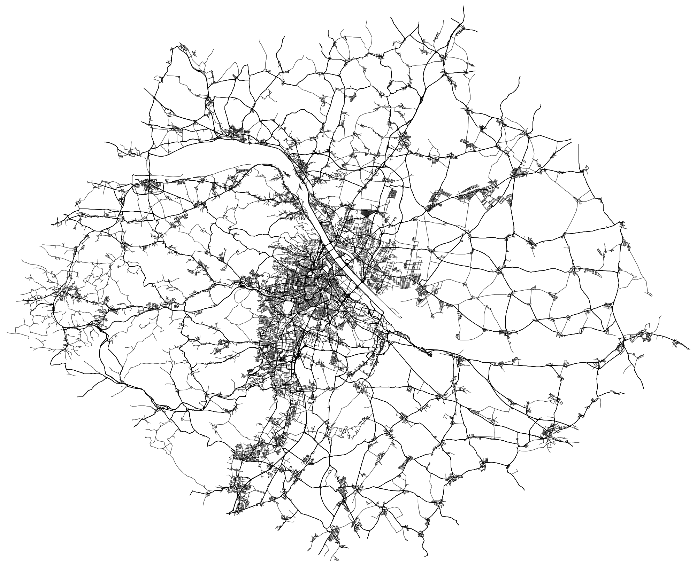

When working with shapefile, the units of the data is not clear. In order to get a sense of the data and its bounds type:


```applescript
geoquery road_shp
ereturn list
```

The command `ereturn list` will show a bunch of values including maximum and minimum on both the axes, the mean values, extent of the layer etc.


Now let's say if we want to zoom in, then all we need to do is type:

```applescript
clippolyline road_shp, box(-7000,11000,330000,355000)
```

This will save the `_shp.dta` file as `_shp_clipped.dta`. We can test it as follows:


```applescript
spmap CAPACITY using road_shp_clipped, id(_ID) ///
	osize(0.02 0.08 1.5) cln(3) legend(off)
```

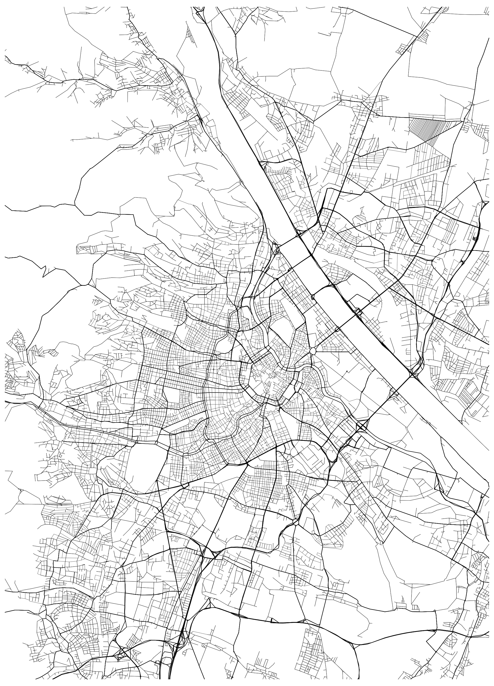


Or we can try another zoom:

```applescript
clippolyline road_shp, box(-5000,10000,335000,345000)

spmap CAPACITY using road_shp_clipped, id(_ID) ///
	osize(0.02 0.08 1.5) cln(3) legend(off)
```

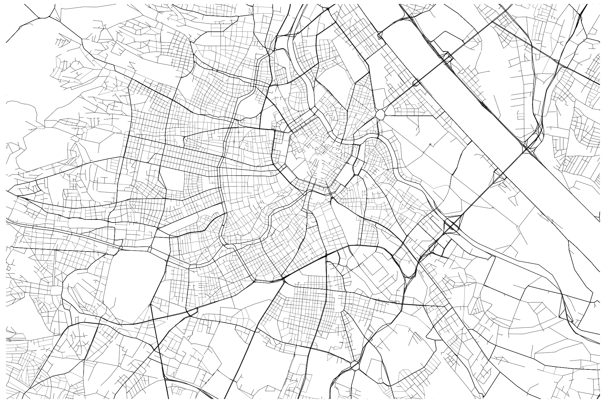


We can now use the `clippolygon` command to clip lines as well:


```
use road, clear
geoquery road_shp
ereturn list	
	
clippolygon road_shp, method(circle) xmid(`e(xmid)') ymid(`e(ymid)') radius(8000)	

spmap CAPACITY using road_shp_clipped, id(_ID) ///
	osize(0.02 0.08 1.5) cln(3) legend(off)
```

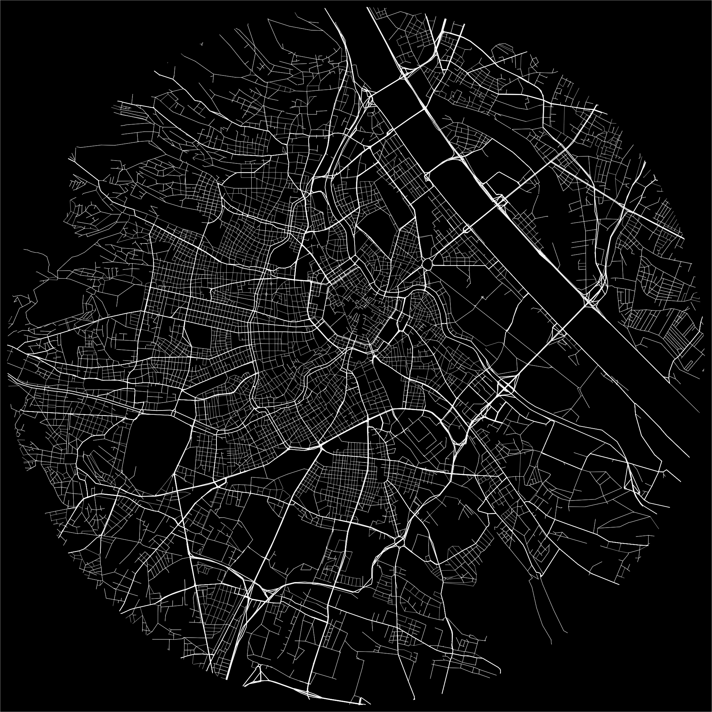


```
clippolygon road_shp, method(circle) xmid(`e(xmid)') ymid(`e(ymid)') radius(8000) points(6)	

spmap CAPACITY using road_shp_clipped, id(_ID) ///
	osize(0.02 0.08 1.5) cln(3) legend(off)
```

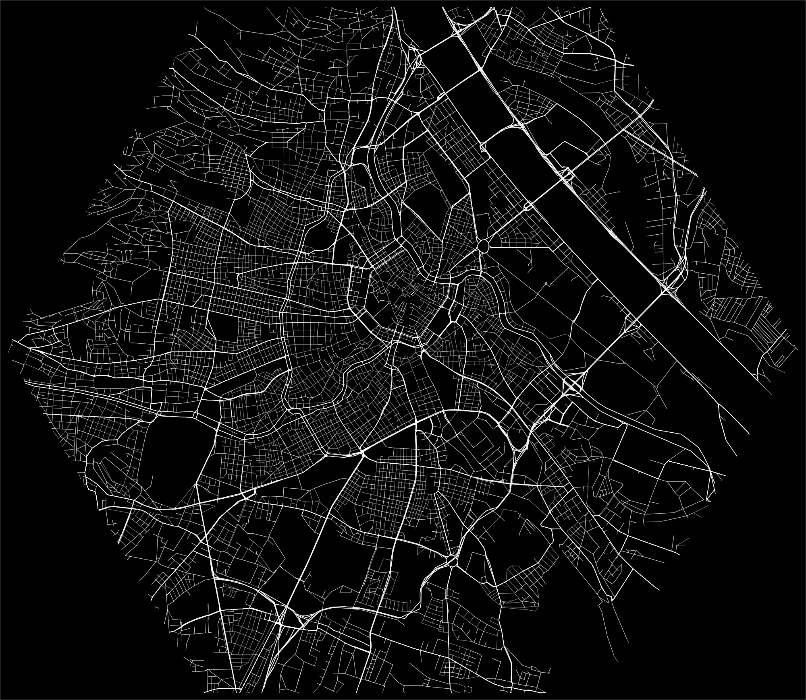

```
clippolygon road_shp, method(circle) xmid(`e(xmid)') ymid(`e(ymid)') radius(8000) points(6)	angle(30)

spmap CAPACITY using road_shp_clipped, id(_ID) ///
	osize(0.02 0.08 1.5) cln(3) legend(off)	
```

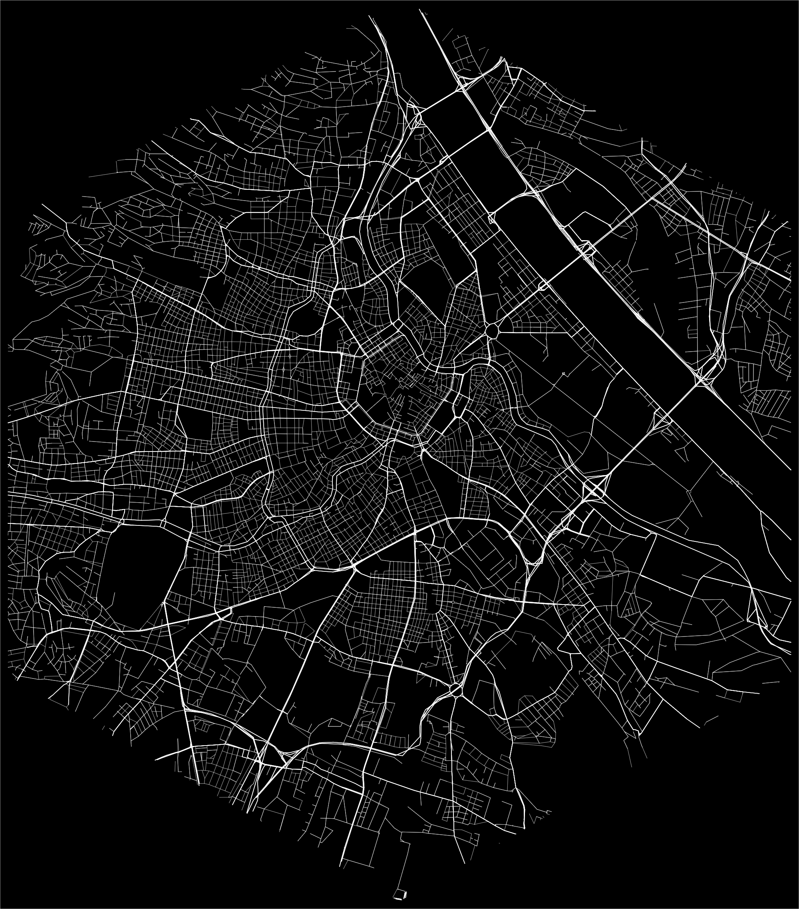


## clippolygon

`clippolygon` takes a polygon shapefile and clips it on a bounding box. The program implements the [Sutherland–Hodgman](https://en.wikipedia.org/wiki/Sutherland%E2%80%93Hodgman_algorithm) algorithm.


We can test it on our `nuts0.dta` (EU countries) and `nuts3.dta` (EU homogenized regions) files.

Let's start with a normal map:

```applescript
use nuts0, clear
spmap _ID using nuts0_shp, id(_ID) cln(8) fcolor(Pastel1) legend(off)
```

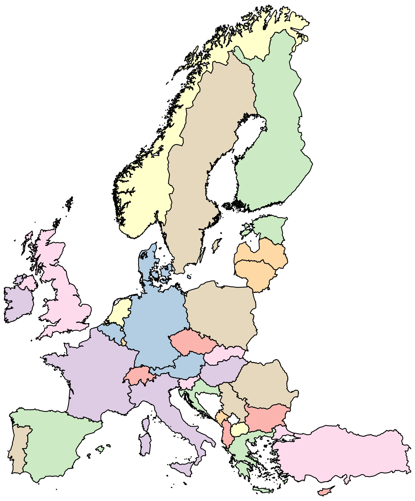


If you happen to know the bounds:

```
clippolygon nuts0_shp, method(box) box(134, 141, -92, -87)
spmap _ID using nuts0_shp_clipped, id(_ID) cln(8) fcolor(Pastel1) legend(off)
```

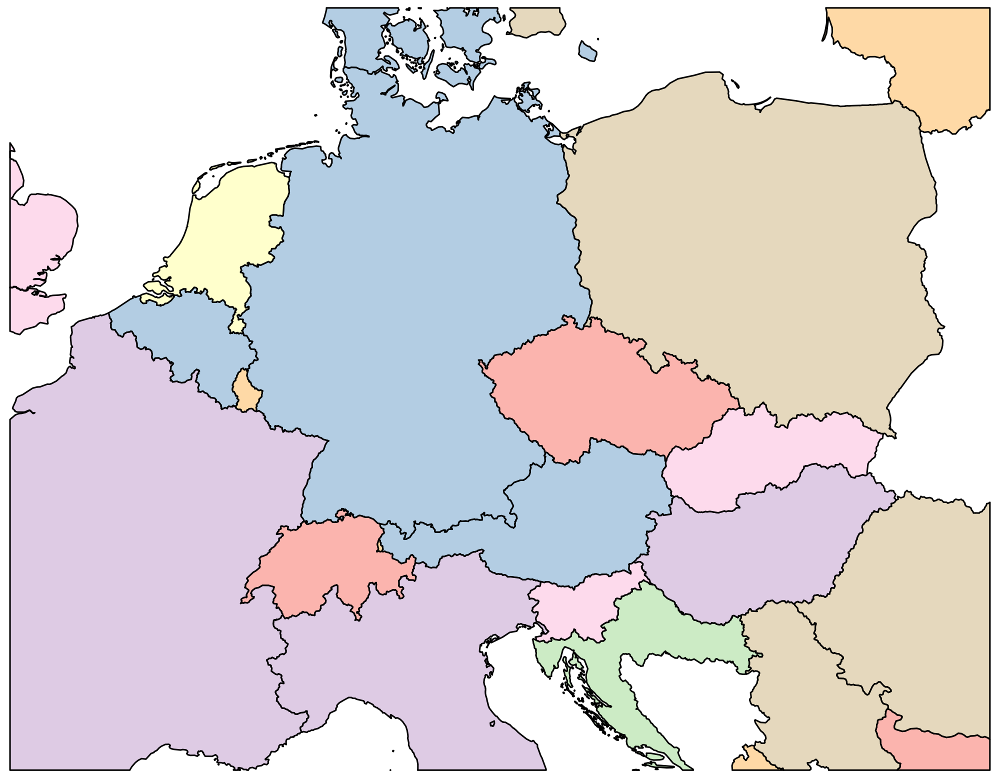


Now let's say we want to zoom in around Austria and create a box around it. Instead of manually defining a box or pasring through the shapefiles, we can make use of the intermediate `geoquery` program:

```applescript
use nuts0, clear
geoquery nuts0_shp if NUTS_ID=="AT", offset(0.2)
clippolygon nuts0_shp, method(box) box("`e(bounds)'")

```

where offset is essentially saying that take the extreme end points of the coordinates of Austria, and extend them by 20%. We can now take the information and pass it to `clippolygon`. This will save the `_shp.dta` file as `_shp_clipped.dta`. And we can test the clipped shapefile as follows:

```applescript
spmap _ID using nuts0_shp_clipped, id(_ID) cln(8) fcolor(Pastel1) legend(off)
```

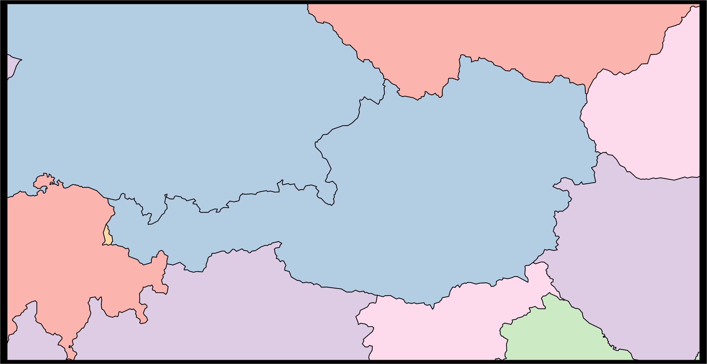


Since we already identified the bounds using the NUTS0 file, we can just pass this infomation from the first clipping:


```applescript
use nuts0, clear
geoquery nuts0_shp if NUTS_ID=="AT", offset(0.3)

clippolygon nuts0_shp, method(box) box("`e(bounds)'")
clippolygon nuts3_shp, method(box) box("`e(bounds)'")
```

Note the it is important to load the base layer that can be merged with the *_shp* file. Once the bounds the determined, the are stored in e-class locals and can be called on later.

Let's test the clipped NUTS3 layer:

```applescript
use nuts3, clear
spmap _ID using nuts3_shp_clipped, id(_ID) cln(8) fcolor(Pastel1) legend(off)
```

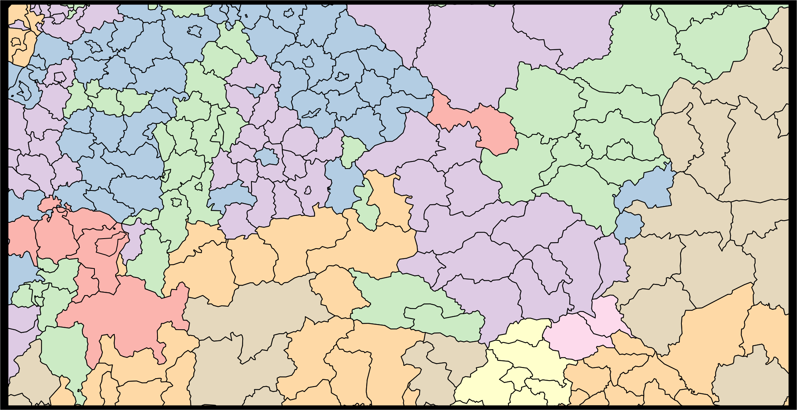


### A more comprehensive example

Now let's plot some actual data and clip the full map. We take the NUTS3 layer and add demographic data to it:

```applescript
use nuts3, clear
merge 1:1 NUTS_ID using demo_r_pjanind3_clean
drop if _m==2	
tab _m  


format yMEDAGEPOP %9.1f


colorpalette viridis, n(11) nograph reverse	
local colors `r(p)'

spmap yMEDAGEPOP using nuts3_shp, ///
	id(_ID) cln(10)  fcolor("`colors'") ///
	ocolor(gs6 ..) osize(0.03 ..) ///
	ndfcolor(gs14) ndocolor(gs6 ..) ndsize(0.03 ..) ndlabel("No data") ///
	polygon(data("nuts0_shp") ocolor(black) osize(0.2 ..) legenda(on) legl("Countries")) ///
	legend(pos(11) region(fcolor(gs15%90)))  legtitle("Median age in years")  legstyle(2)  ///
	note("Data source: Eurostat table: demo_r_pjanind3. NUTS 2016 layers from Eurostat GISCO.", size(1.5)) 
```

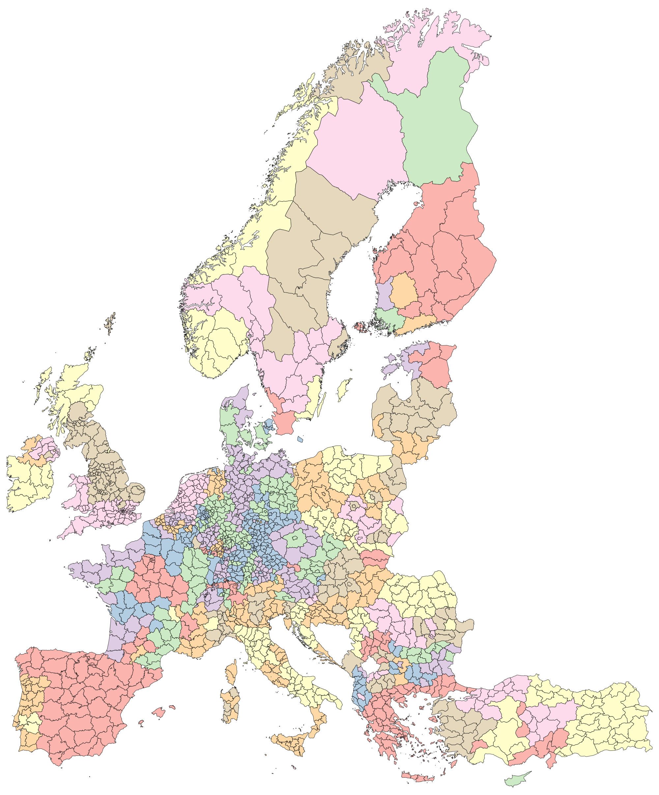


And we plot it again:

```applescript
colorpalette viridis, n(11) nograph reverse	
local colors `r(p)'

spmap yMEDAGEPOP using nuts3_shp_clipped, ///
	id(_ID) cln(10)  fcolor("`colors'") ///
	ocolor(gs6 ..) osize(0.03 ..) ///
	ndfcolor(gs14) ndocolor(gs6 ..) ndsize(0.03 ..) ndlabel("No data") ///
	polygon(data("nuts0_shp_clipped") ocolor(black) osize(0.2 ..) legenda(on) legl("Countries")) ///
	legend(pos(11) region(fcolor(gs15%90)))  legtitle("Median age in years")  legstyle(2)  ///
	note("Data source: Eurostat table: demo_r_pjanind3. NUTS 2016 layers from Eurostat GISCO.", size(1.5)) 
```


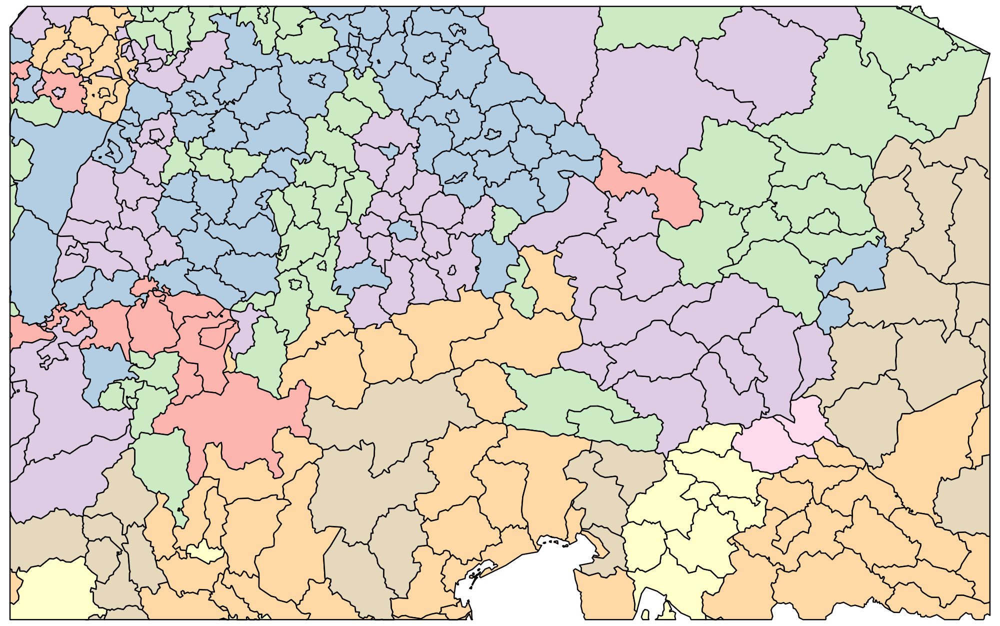


### Circular clipping

```
use nuts0, clear
geoquery nuts0_shp if CNTR_CODE=="AT", offset(0.3)
ereturn list
clippolygon nuts0_shp, method(circle) xmid(`e(xmid)') ymid(`e(ymid)') radius(`e(radius)') points(100)
clippolygon nuts3_shp, method(circle) xmid(`e(xmid)') ymid(`e(ymid)') radius(`e(radius)') points(100)

spmap _ID using nuts0_shp_clipped, id(_ID) cln(8) fcolor(Pastel1) legend(off)
```

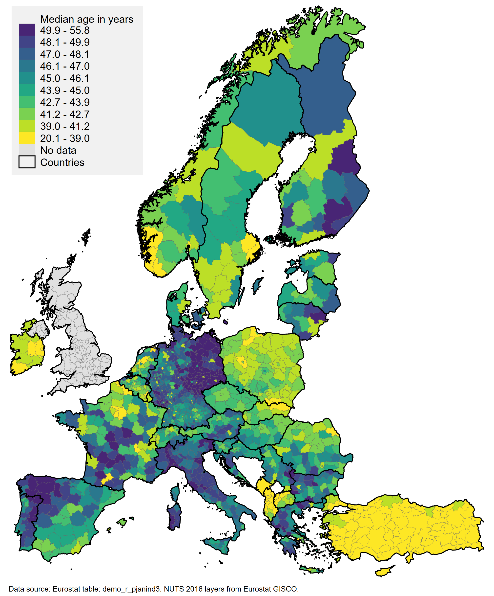


```
use nuts3, clear
merge 1:1 NUTS_ID using demo_r_pjanind3_clean
drop if _m==2	
tab _m  

format yMEDAGEPOP %9.1f

colorpalette viridis, n(11) nograph reverse	
local colors `r(p)'

spmap yMEDAGEPOP using nuts3_shp_clipped, ///
	id(_ID) cln(10)  fcolor("`colors'") ///
	ocolor(gs6 ..) osize(0.03 ..) ///
	ndfcolor(gs14) ndocolor(gs6 ..) ndsize(0.03 ..) ndlabel("No data") ///
	polygon(data("nuts0_shp_clipped") ocolor(black) osize(0.2 ..) legenda(on) legl("Countries")) ///
	legend(pos(11) region(fcolor(gs15%90)))  legtitle("Median age in years")  legstyle(2)  ///
	note("Data source: Eurostat table: demo_r_pjanind3. NUTS 2016 layers from Eurostat GISCO.", size(1.5)) 
```

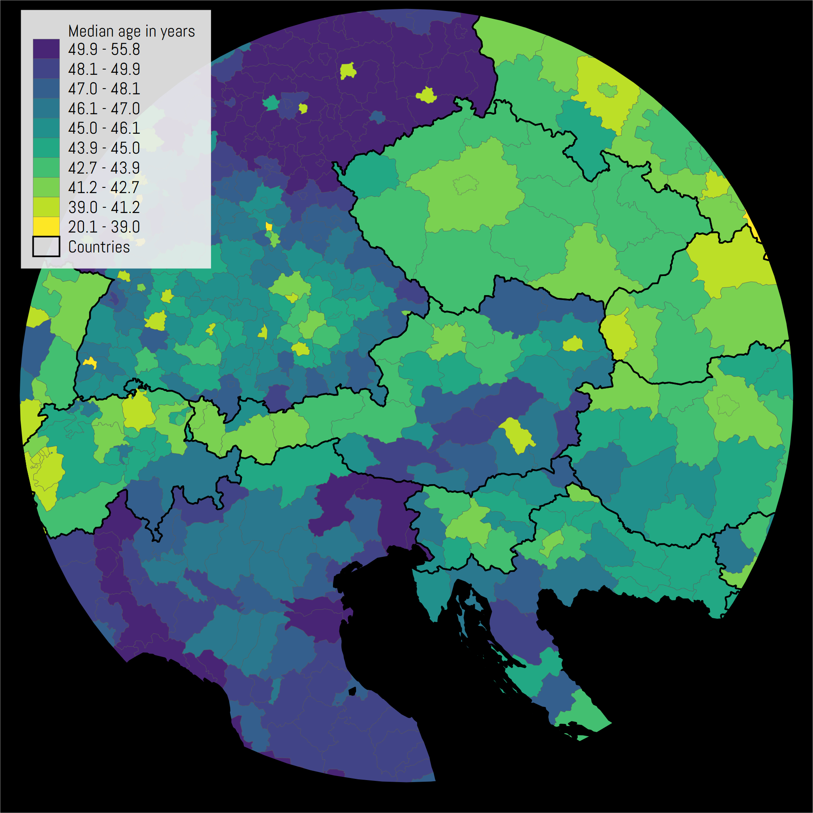


### Polygon clipping

```
use nuts0, clear
geoquery nuts0_shp if CNTR_CODE=="AT", offset(0.3)
ereturn list
clippolygon nuts0_shp, method(circle) xmid(`e(xmid)') ymid(`e(ymid)') radius(`e(radius)') points(8)
clippolygon nuts3_shp, method(circle) xmid(`e(xmid)') ymid(`e(ymid)') radius(`e(radius)') points(8)


use nuts3, clear
merge 1:1 NUTS_ID using demo_r_pjanind3_clean
drop if _m==2	
tab _m  

format yMEDAGEPOP %9.1f

colorpalette viridis, n(11) nograph reverse	
local colors `r(p)'

spmap yMEDAGEPOP using nuts3_shp_clipped, ///
	id(_ID) cln(10)  fcolor("`colors'") ///
	ocolor(gs6 ..) osize(0.03 ..) ///
	ndfcolor(gs14) ndocolor(gs6 ..) ndsize(0.03 ..) ndlabel("No data") ///
	polygon(data("nuts0_shp_clipped") ocolor(black) osize(0.2 ..) legenda(on) legl("Countries")) ///
	legend(pos(11) region(fcolor(gs15%90)))  legtitle("Median age in years")  legstyle(2)  ///
	note("Data source: Eurostat table: demo_r_pjanind3. NUTS 2016 layers from Eurostat GISCO.", size(1.5)) 
```

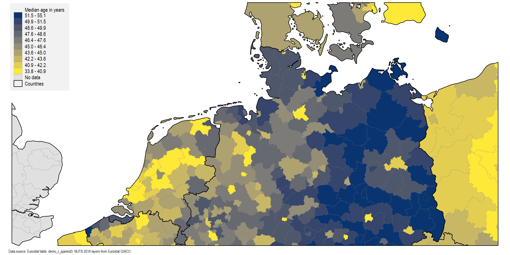


```
use nuts0, clear
geoquery nuts0_shp if CNTR_CODE=="AT", offset(0.3)
ereturn list
clippolygon nuts0_shp, method(circle) xmid(`e(xmid)') ymid(`e(ymid)') radius(`e(radius)') points(6)
clippolygon nuts3_shp, method(circle) xmid(`e(xmid)') ymid(`e(ymid)') radius(`e(radius)') points(6)

use nuts3, clear
merge 1:1 NUTS_ID using demo_r_pjanind3_clean
drop if _m==2	
tab _m  

format yMEDAGEPOP %9.1f

colorpalette viridis, n(11) nograph reverse	
local colors `r(p)'

spmap yMEDAGEPOP using nuts3_shp_clipped, ///
	id(_ID) cln(10)  fcolor("`colors'") ///
	ocolor(gs6 ..) osize(0.03 ..) ///
	ndfcolor(gs14) ndocolor(gs6 ..) ndsize(0.03 ..) ndlabel("No data") ///
	polygon(data("nuts0_shp_clipped") ocolor(black) osize(0.2 ..) legenda(on) legl("Countries")) ///
	legend(pos(11) region(fcolor(gs15%90)))  legtitle("Median age in years")  legstyle(2)  ///
	note("Data source: Eurostat table: demo_r_pjanind3. NUTS 2016 layers from Eurostat GISCO.", size(1.5)) 
```

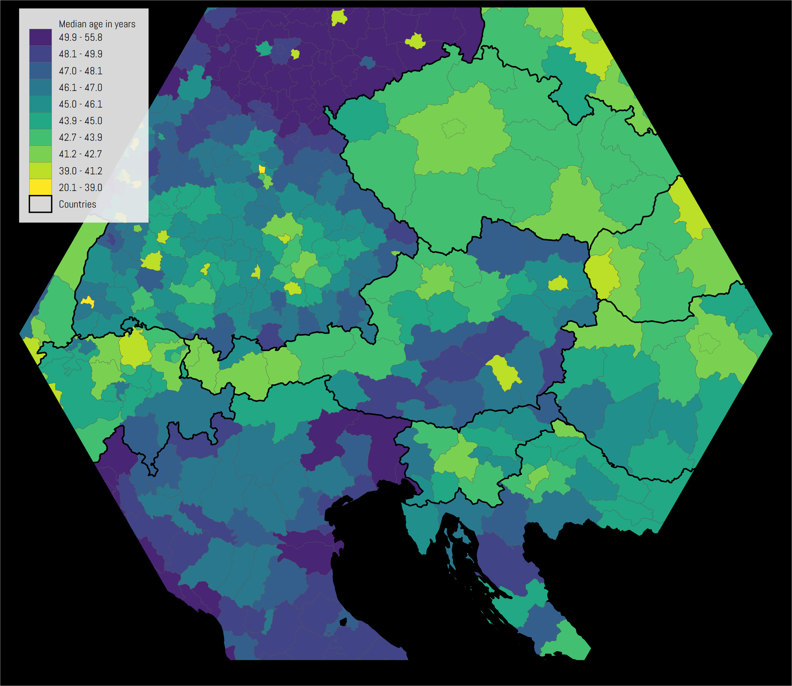


```
use nuts0, clear
geoquery nuts0_shp if CNTR_CODE=="AT", offset(0.1)
ereturn list
clippolygon nuts0_shp, method(circle) xmid(`e(xmid)') ymid(`e(ymid)') radius(`e(radius)') points(6) angle(30)
clippolygon nuts3_shp, method(circle) xmid(`e(xmid)') ymid(`e(ymid)') radius(`e(radius)') points(6) angle(30)


use nuts3, clear
merge 1:1 NUTS_ID using demo_r_pjanind3_clean
drop if _m==2	
tab _m  

format yMEDAGEPOP %9.1f

colorpalette carto Tropic, n(11) nograph reverse	
local colors `r(p)'

spmap yMEDAGEPOP using nuts3_shp_clipped, ///
	id(_ID) cln(10)  fcolor("`colors'") ///
	ocolor(gs6 ..) osize(0.03 ..) ///
	ndfcolor(gs14) ndocolor(gs6 ..) ndsize(0.03 ..) ndlabel("No data") ///
	polygon(data("nuts0_shp_clipped") select(keep if _ID==7) ocolor(black) osize(0.2 ..) legenda(on) legl("Countries")) ///  // select(keep if _ID==7) 
	legend(pos(11) region(fcolor(gs15%90)))  legtitle("Median age in years")  legstyle(2)  ///
	note("Data source: Eurostat table: demo_r_pjanind3. NUTS 2016 layers from Eurostat GISCO.", size(1.5)) 
```

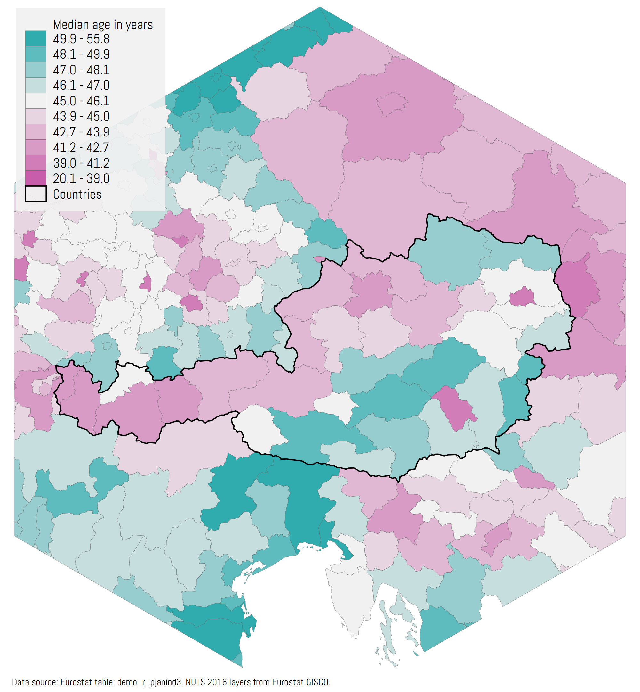


```
use nuts0, clear
geoquery nuts0_shp if NUTS_ID=="DE", offset(0.2)

clippolygon nuts0_shp, method(box) box("`e(bounds)'")
clippolygon nuts3_shp, method(box) box("`e(bounds)'")

use nuts3, clear
merge 1:1 NUTS_ID using demo_r_pjanind3_clean
drop if _m==2	
tab _m  


format yMEDAGEPOP %4.1f

colorpalette CET L20, n(11) nograph reverse	
local colors `r(p)'	
	
spmap yMEDAGEPOP using nuts3_shp_clipped, ///
	id(_ID) cln(10)  fcolor("`colors'") ///
	ocolor(gs6 ..) osize(0.03 ..) ///
	ndfcolor(gs14) ndocolor(gs6 ..) ndsize(0.03 ..) ndlabel("No data") ///
	polygon(data("nuts0_shp_clipped") select(keep if _ID==8)  ocolor(black) osize(0.4 ..) legenda(on) legl("Countries")) ///
	legend(pos(11) region(fcolor(gs15%90)))  legtitle("Median age in years")  legstyle(2)  ///
	note("Data source: Eurostat table: demo_r_pjanind3. NUTS 2016 layers from Eurostat GISCO.", size(1.5)) 
```

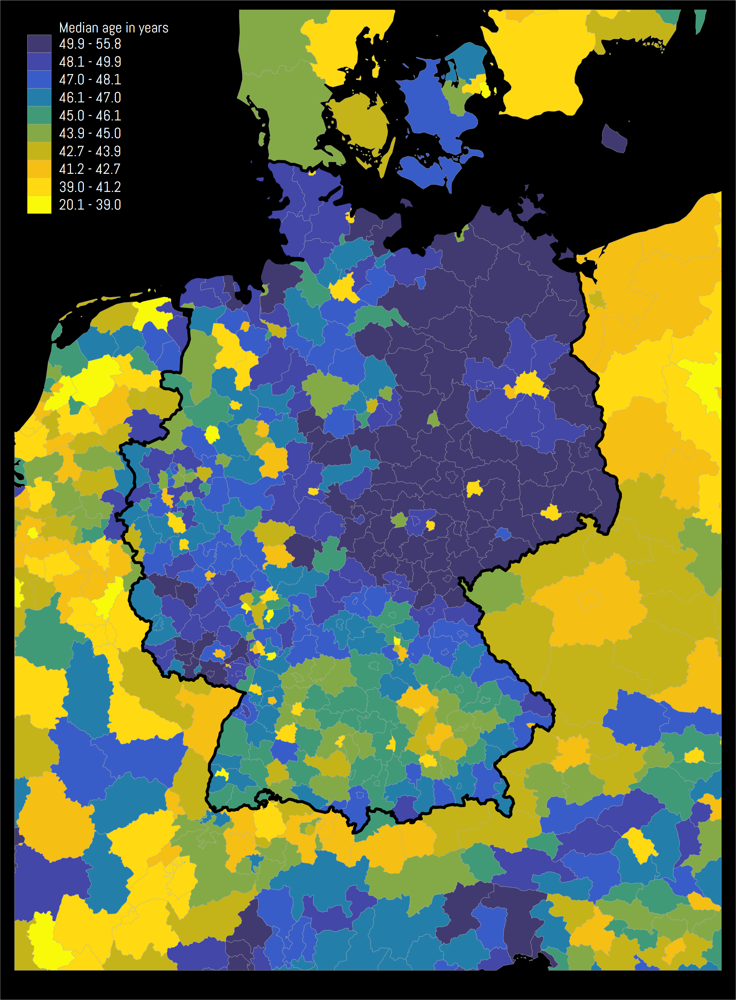


```
use nuts0, clear
geoquery nuts0_shp if NUTS_ID=="DE", offset(0.2)

clippolygon nuts0_shp, method(circle) xmid(`e(xmid)') ymid(`e(ymid)') radius(`e(radius)')
clippolygon nuts3_shp, method(circle) xmid(`e(xmid)') ymid(`e(ymid)') radius(`e(radius)')

use nuts3, clear
merge 1:1 NUTS_ID using demo_r_pjanind3_clean
drop if _m==2	
tab _m  


format yMEDAGEPOP %4.1f

colorpalette scico hawaii, n(11) nograph reverse	
local colors `r(p)'	
	
spmap yMEDAGEPOP using nuts3_shp_clipped, ///
	id(_ID) cln(10)  fcolor("`colors'") ///
	ocolor(gs6 ..) osize(0.03 ..) ///
	ndfcolor(gs14) ndocolor(gs6 ..) ndsize(0.03 ..) ndlabel("No data") ///
	polygon(data("nuts0_shp_clipped") select(keep if _ID==8)  ocolor(black) osize(0.2 ..) legenda(on) legl("Countries")) ///
	legend(pos(11) region(fcolor(gs15%90)))  legtitle("Median age in years")  legstyle(2)  ///
	note("Data source: Eurostat table: demo_r_pjanind3. NUTS 2016 layers from Eurostat GISCO.", size(1.5)) 
```

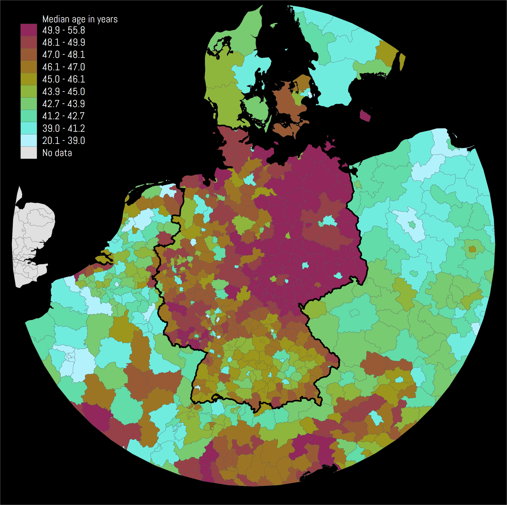

---

## Feedback

Please open an [issue](https://github.com/asjadnaqvi/stata-clipgeo/issues) to report errors, feature enhancements, and/or other requests. 


## Change log

**v2.1 (14 May 2024)**
- Fixed a bug where negative offset was not working in `geoquery` (reported by LPecht).
- Some code cleanups.

**v2.0 (08 Sep 2022)**
- Circular and polygon clipping.
- Changes to syntaxes.
- Major optimizings to export to Stata.

**v1.2 (31 Jul 2022)**
- Checks added to see if the bounding box contains any shape (reported by KyleMeng, PaulFrissard). 
- `geoquery` added to make it easier to find the bounding boxes.
- `clipline` merged with `clippolyline`.


**v1.1 (07 May 2022)**
- Fixed a bug in corners being missed.
- Code clean-up.

**v1.0 (02 Apr 2022)**
- First release


