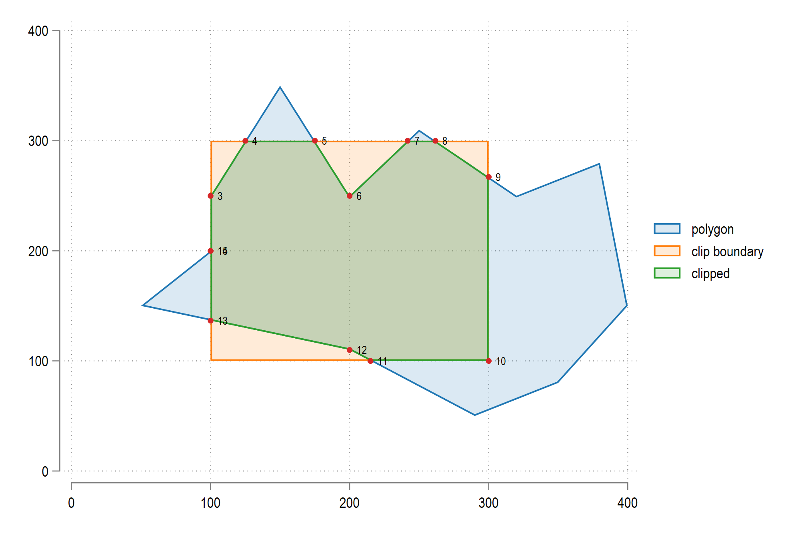
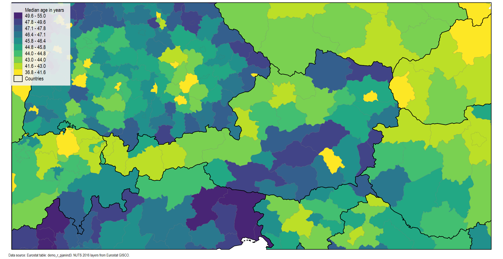
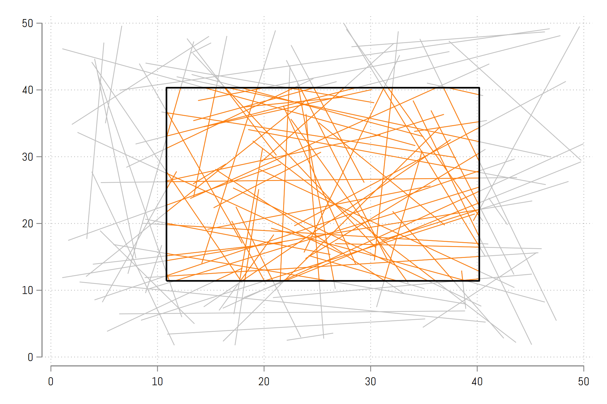
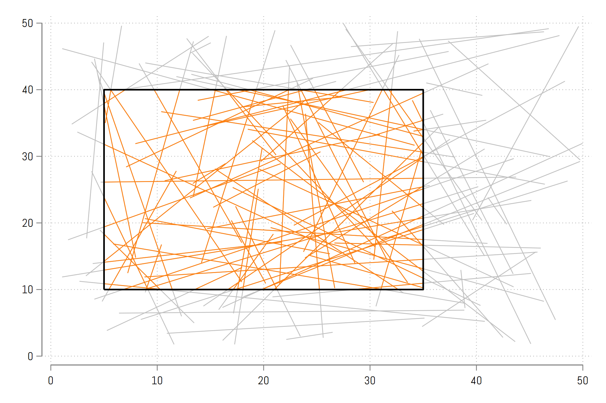

     


# clipgeo package v1.1

*This  release: 08 May 2022*
*First release: 04 Apr 2022*

This package provides two programs: `clippolyline` and `clippolygeo` that clip Stata shape files (_shp.dta) on a bounding box.

This allows us to zoom in maps to specific regions while still preserving geometry of clipped regions.

The package can be installed as follows:

```applescript
net install clipgeo, from("https://raw.githubusercontent.com/asjadnaqvi/stata-clipgeo/main/installation/") replace
```

The contents are described below:

## clippolyline

clippolyline takes a polyline shapefile and clips it on a manually-defined bounding box. This program is a wrapper for `clipline` that implements the [Cohen-Sutherland](https://en.wikipedia.org/wiki/Cohen%E2%80%93Sutherland_algorithm) algorithm in Stata.


In order to test the program, you can download the files in the [GIS](/GIS) folder and copy them to a directory.

The file `road.dta` provides the road grid for the city of Vienna and was extracted from OpenStreetMaps (OSM).

The spatial files can be plotted as follows:

```applescript
spmap CAPACITY using road_shp, id(_ID) ///
	osize(0.02 0.08 1.5) cln(3) legend(off)
```


Now let's say if we want to zoom in, then all we need to do is type:

```applescript
clippolyline road_shp, box(-7000,11000,330000,355000)
```

This will save the `_shp.dta` file as `_shp_clipped.dta`. We can test it as follows:


```applescript
spmap CAPACITY using road_shp_clipped, id(_ID) ///
	osize(0.02 0.08 1.5) cln(3) legend(off)
```


Or we can try another zoom:

```applescript
clippolyline road_shp, box(-5000,10000,335000,345000)

spmap CAPACITY using road_shp_clipped, id(_ID) ///
	osize(0.02 0.08 1.5) cln(3) legend(off)
```


## clippolygon

`clippolygon` takes a polygon shapefile and clips it on a manually defined bounding box. The program implements the [Sutherland–Hodgman](https://en.wikipedia.org/wiki/Sutherland%E2%80%93Hodgman_algorithm) algorithm.





We can test it on our `nuts0.dta` (EU countries) and `nuts3.dta` (EU homogenized regions) files.

Let's start with a normal map:

```applescript
use nuts0, clear
spmap _ID using nuts0_shp, id(_ID) cln(8) fcolor(Pastel1) legend(off)
```


Now let's say we want to zoom in around Austria and create a box around it:

```applescript
clippolygon nuts0_shp, box(128, 146, -94, -80)
```

This will save the `_shp.dta` file as `_shp_clipped.dta`. And we can test the clipped shapefile as follows:

```applescript
spmap _ID using nuts0_shp_clipped, id(_ID) cln(8) fcolor(Pastel1) legend(off)
```


*Here we can see the clipping error in the top left corner. This will be fixed as soon as I can figure out what is causing it. All the tests run fine on dummy data.*


So how do we get these bounds? We can look into the _shp file for coordinates:

```applescript
use nuts0_shp, clear
twoway scatter _Y _X, msize(vsmall)
```


We can use the twoway grids as reference points. Let's generate another tighter clipping around Austria:

```applescript
clippolygon nuts0_shp, box(133, 141, -92, -87)

use nuts0, clear
spmap _ID using nuts0_shp_clipped, id(_ID) cln(8) fcolor(Pastel1) legend(off)
graph export clippolygon4.png, replace wid(2000)	
```


Since we have NUTS3 file as well, we can also clip this. Let's plot the full map

```applescript
use nuts3, clear
spmap _ID using nuts3_shp, id(_ID) cln(8) osize(0.04 ..) fcolor(Pastel1) legend(off)
```


and its clipped version with the same extent as above:

```applescript
clippolygon nuts3_shp, box(133, 141, -92, -87)

spmap _ID using nuts3_shp_clipped, id(_ID) cln(8) fcolor(Pastel1) legend(off)
```


### A more comprehensive example

Now let's plot some actual data and clip the full map. We take the NUTS3 layer and add demographic data to it:

```applescript
use nuts3, clear
merge 1:1 NUTS_ID using demo_r_pjanind3_clean
drop if _m==2	// UK gets dropped
tab _m  
```

and we map it with all the bells and whistles:

```applescript
format yMEDAGEPOP %9.1f

colorpalette viridis, n(11) nograph reverse	
local colors `r(p)'

spmap yMEDAGEPOP using nuts3_shp, ///
	id(_ID) cln(10)  fcolor("`colors'") ///
	ocolor(gs6 ..) osize(0.03 ..) ///
	ndfcolor(gs14) ndocolor(gs6 ..) ndsize(0.03 ..) ndlabel("No data") ///
	polygon(data("nuts0_shp") ocolor(black) osize(0.2 ..) legenda(on) legl("Countries")) ///
	legend(pos(11) region(fcolor(gs15%90)))  legtitle("Median age in years")  legstyle(2)  ///
	note("Data source: Eurostat table: demo_r_pjanind3. NUTS 2016 layers from Eurostat GISCO.", size(1.5)) 
```


Now we clip both the layers:

```applescript
clippolygon nuts0_shp, box(133, 141, -92, -87)	
clippolygon nuts3_shp, box(133, 141, -92, -87)
```

and swap these in the above code:

```applescript
colorpalette viridis, n(11) nograph reverse	
local colors `r(p)'

spmap yMEDAGEPOP using nuts3_shp_clipped, ///
	id(_ID) cln(10)  fcolor("`colors'") ///
	ocolor(gs6 ..) osize(0.03 ..) ///
	ndfcolor(gs14) ndocolor(gs6 ..) ndsize(0.03 ..) ndlabel("No data") ///
	polygon(data("nuts0_shp_clipped") ocolor(black) osize(0.2 ..) legenda(on) legl("Countries")) ///
	legend(pos(11) region(fcolor(gs15%90)))  legtitle("Median age in years")  legstyle(2)  ///
	note("Data source: Eurostat table: demo_r_pjanind3. NUTS 2016 layers from Eurostat GISCO.", size(1.5)) 
```

And we get this map:


Since we are reading the full data for the legend categories, we can just generate a dummy variable to make sure the legend only captures the extent shown:

```applescript
cap drop box	
gen box = .
replace box = 1 if inrange(_CX, 133, 141)
replace box = 1 if inrange(_CY, -92, -87)
```

And we plot it again:

```applescript
colorpalette viridis, n(11) nograph reverse	
local colors `r(p)'	
	
spmap yMEDAGEPOP using nuts3_shp_clipped if box==1, ///
	id(_ID) cln(10)  fcolor("`colors'") ///
	ocolor(gs6 ..) osize(0.03 ..) ///
	ndfcolor(gs14) ndocolor(gs6 ..) ndsize(0.03 ..) ndlabel("No data") ///
	polygon(data("nuts0_shp_clipped") ocolor(black) osize(0.2 ..) legenda(on) legl("Countries")) ///
	legend(pos(11) region(fcolor(gs15%90)))  legtitle("Median age in years")  legstyle(2)  ///
	note("Data source: Eurostat table: demo_r_pjanind3. NUTS 2016 layers from Eurostat GISCO.", size(1.5)) 
```

Which gives us our final map:




*the corner boundary error is being investigated.


## clipline v1.1

*This  release: 08 Feb 2022*
*First release: 05 Dec 2021*


This package implements the Cohen-Sutherland line clipping algorithm in Stata. This is an intermediate program to help support other programs. This program can also be used indepedantly.


Check the helpfile:

```applescript
help clipline
```

The required syntax is as follows:

```applescript
clipline x1 y1 x2 y2, [box(x_min x_max y_min y_max)] [offset(number)] [lines] [box]
```

Here is a test code, which is also provided in the dofile above:

```applescript
clear
set obs 100


// generate random lines
gen id = _n
gen x1 = runiform(1,50)
gen y1 = runiform(1,50)
gen x2 = runiform(1,50)
gen y2 = runiform(1,50)
```

We can use a -0.2 factor offset which reduced the box by 20% from the extent of the coordinates:

```applescript
clipline x1 y1 x2 y2, lines addbox offset(-0.2)
```

The option `lines` adds the information on the lines back to Stata. The option `addbox` adds the box bounds back to Stata. Both are specified for drawing the box:

```applescript
	twoway ///
		(pcspike y1 x1 y2 x2, lw(thin) lc(gs12)) ///
		(pcspike clip_y1 clip_x1 clip_y2 clip_x2, lw(thin)) ///
		(line box_y box_x, lc(black) lw(0.4)) ///
			, legend(off) 
```




You can also specify your own box and clipping extent:


```applescript
clipline x1 y1 x2 y2, box(5 35 10 40) lines addbox
```

Here we define a custom box bounds:

```applescript
	twoway ///
		(pcspike y1 x1 y2 x2, lw(thin) lc(gs12)) ///
		(pcspike clip_y1 clip_x1 clip_y2 clip_x2, lw(thin)) ///
		(line box_y box_x, lc(black) lw(0.4)) ///
			, legend(off) 
```




---

## Feedback

Please open an [issue](https://github.com/asjadnaqvi/stata-clipgeo/issues) to report errors, feature enhancements, and/or other requests. 


## Versions

**v1.1 (07 May 2022)**
- Fixed a bug in corners being missed.
- Code clean-up.

**v1.0 (02 Apr 2022)**
- First release


