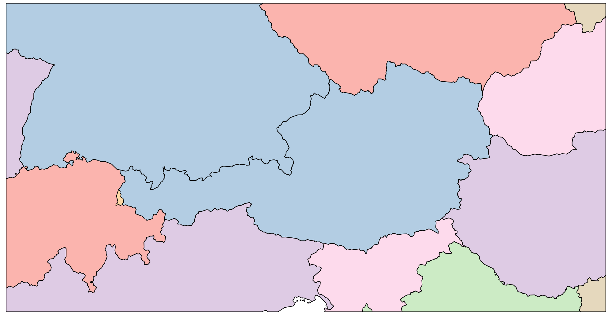
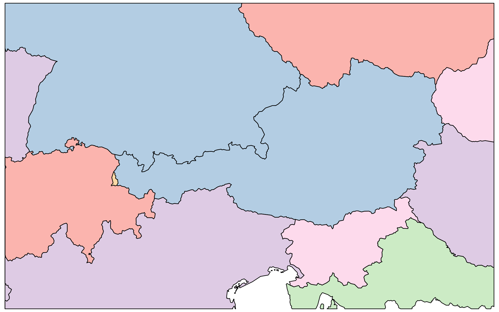
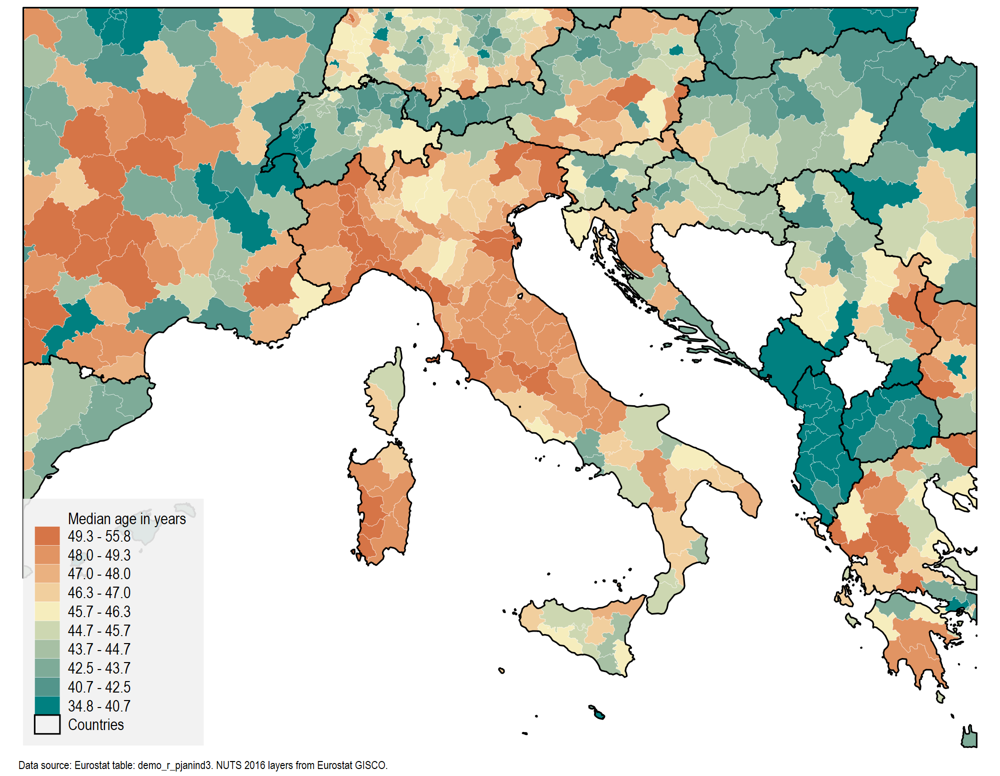

     


# clipgeo package v1.2 (beta)

*This  release: 31 Jul 2022*, *First release: 04 Apr 2022*

This package is a collection of three commands:


|Package|Version|Description|
|----| ---- | ---- 
`clippolyline` | 1.1 | clip polylines |
`clippolygon` | 1.2 | clip polygons |
`geoquery` | 1.0 | query shapefiles |

The first two commands allow us to clip and zoom into map regions based on the geometry defined in a shapefile. The `geoquery` command provides summary statistics for shapefiles. This command makes it easier to find the bounds that can be passed on to `clippolyline` and `clippolygon`.

The package can be installed via SSC or GitHub. The GitHub version, might be more recent due to bug fixes, feature updates etc, and may contain syntax improvements and changes in default values. See version numbers below. Eventually the GitHub version is published on SSC.


From SSC (**v1.1**):

```applescript
ssc install clipgeo, replace
```

From GitHub (**v1.2**) *(UPDATED)*:

```applescript
net install clipgeo, from("https://raw.githubusercontent.com/asjadnaqvi/stata-clipgeo/main/installation/") replace
```


:warning: The package process shapefiles generated by Stata's `spshp2dta` command only! This means that the attributes file should contain the `_ID` variable, and the shapefile should contain `_ID, _X, _Y, shape_order` variables. If you use the user-written command `shp2dta`, the code will not work. :warning: 

The package is still in **beta** and may still need further improvements, error checks, etc. Please report these in the [Issues](https://github.com/asjadnaqvi/stata-clipgeo/issues) section.

## clippolyline

`clippolyline` takes a polyline shapefile and clips it on a manually-defined bounding box. The program implements the [Cohen-Sutherland](https://en.wikipedia.org/wiki/Cohen%E2%80%93Sutherland_algorithm) algorithm.

In order to test the program, you can download the files in the [GIS](/GIS) folder and copy them to a directory.

The file `road.dta` provides the road grid for the city of Vienna and was extracted from OpenStreetMaps (OSM). It can be plotted as follows:


```applescript
use road, clear
spmap CAPACITY using road_shp, id(_ID) ///
	osize(0.02 0.08 1.5) cln(3) legend(off)
```


When working with shapefile, the units of the data is not clear. In order to get a sense of the data and its bounds type:


```applescript
geoquery road_shp
ereturn list
```

The command `ereturn list` will show a bunch of values including maximum and minimum on both the axes, the mean values, extent of the layer etc.


Now let's say if we want to zoom in, then all we need to do is type:

```applescript
clippolyline road_shp, box(-7000,11000,330000,355000)
```

This will save the `_shp.dta` file as `_shp_clipped.dta`. We can test it as follows:


```applescript
spmap CAPACITY using road_shp_clipped, id(_ID) ///
	osize(0.02 0.08 1.5) cln(3) legend(off)
```


Or we can try another zoom:

```applescript
clippolyline road_shp, box(-5000,10000,335000,345000)

spmap CAPACITY using road_shp_clipped, id(_ID) ///
	osize(0.02 0.08 1.5) cln(3) legend(off)
```


## clippolygon

`clippolygon` takes a polygon shapefile and clips it on a bounding box. The program implements the [Sutherland–Hodgman](https://en.wikipedia.org/wiki/Sutherland%E2%80%93Hodgman_algorithm) algorithm.


We can test it on our `nuts0.dta` (EU countries) and `nuts3.dta` (EU homogenized regions) files.

Let's start with a normal map:

```applescript
use nuts0, clear
spmap _ID using nuts0_shp, id(_ID) cln(8) fcolor(Pastel1) legend(off)
```


Now let's say we want to zoom in around Austria and create a box around it. Instead of manually defining a box or pasring through the shapefiles, we can make use of the intermediate `geoquery` program:

```applescript
use nuts0, clear
geoquery nuts0_shp if NUTS_ID=="AT", offset(0.3)
ereturn list

```

where offset is essentially saying that take the extreme end points of the coordinates of Austria, and extend them by 30%. We can now take the information and pass it to `clippolygon`:


```applescript
clippolygon nuts0_shp, box("`e(bounds)'")
```

This will save the `_shp.dta` file as `_shp_clipped.dta`. And we can test the clipped shapefile as follows:

```applescript
spmap _ID using nuts0_shp_clipped, id(_ID) cln(8) fcolor(Pastel1) legend(off)
```




### Manually entering the bounds

We can also manually enter the bounds directly (if we know them):

```
use nuts0, clear
clippolygon nuts0_shp, box(133, 141, -92, -87)
spmap _ID using nuts0_shp_clipped, id(_ID) cln(8) fcolor(Pastel1) legend(off)
```



We can also peruse the _shp file for coordinates:

```applescript
use nuts0_shp, clear
twoway scatter _Y _X, msize(vsmall)
```


where the grids can be used to determine the reference points. 


### NUTS 3 clipping

Let's plot the full NUTS 3 layer:

```applescript
use nuts3, clear
spmap _ID using nuts3_shp, id(_ID) cln(8) osize(0.04 ..) fcolor(Pastel1) legend(off)
```


Since we already identified the bounds using the NUTS0 file, we can just pass this infomation from the first clipping:


```applescript
use nuts0, clear
geoquery nuts0_shp if NUTS_ID=="AT", offset(0.3)

clippolygon nuts0_shp, box("`e(bounds)'")
clippolygon nuts3_shp, box("`e(bounds)'")
```

Note the it is important to load the base layer that can be merged with the *_shp* file. Once the bounds the determined, the are stored in e-class locals and can be called on later.

Let's test the clipped NUTS3 layer:

```applescript
use nuts3, clear
spmap _ID using nuts3_shp_clipped, id(_ID) cln(8) fcolor(Pastel1) legend(off)
```


### A more comprehensive example

Now let's plot some actual data and clip the full map. We take the NUTS3 layer and add demographic data to it:

```applescript
use nuts3, clear
merge 1:1 NUTS_ID using demo_r_pjanind3_clean
drop if _m==2	// UK gets dropped
tab _m  
```

and we map it with all the bells and whistles and the clipped files:


```applescript
colorpalette viridis, n(11) nograph reverse	
local colors `r(p)'

spmap yMEDAGEPOP using nuts3_shp_clipped, ///
	id(_ID) cln(10)  fcolor("`colors'") ///
	ocolor(gs6 ..) osize(0.03 ..) ///
	ndfcolor(gs14) ndocolor(gs6 ..) ndsize(0.03 ..) ndlabel("No data") ///
	polygon(data("nuts0_shp_clipped") ocolor(black) osize(0.2 ..) legenda(on) legl("Countries")) ///
	legend(pos(11) region(fcolor(gs15%90)))  legtitle("Median age in years")  legstyle(2)  ///
	note("Data source: Eurostat table: demo_r_pjanind3. NUTS 2016 layers from Eurostat GISCO.", size(1.5)) 
```

Which gives us this map


Since we are reading the full data for the legend categories, we can just generate a dummy variable to make sure the legend only captures the extent shown:

```applescript
cap drop box	
gen box = .

// increase the corner points slightly to avoid having blank shapes in maps (this needs to be automated)

replace box = 1 if inrange(_CX,132, 142) & inrange(_CY, -93, -86)	
```

And we plot it again:

```applescript
colorpalette viridis, n(11) nograph reverse	
local colors `r(p)'	
	
spmap yMEDAGEPOP using nuts3_shp_clipped if box==1, ///
	id(_ID) cln(10)  fcolor("`colors'") ///
	ocolor(gs6 ..) osize(0.03 ..) ///
	ndfcolor(gs14) ndocolor(gs6 ..) ndsize(0.03 ..) ndlabel("No data") ///
	polygon(data("nuts0_shp_clipped") ocolor(black) osize(0.2 ..) legenda(on) legl("Countries")) ///
	legend(pos(11) region(fcolor(gs15%90)))  legtitle("Median age in years")  legstyle(2)  ///
	note("Data source: Eurostat table: demo_r_pjanind3. NUTS 2016 layers from Eurostat GISCO.", size(1.5)) 
```


### Another example 1

Clip around Germany with a 20% extension to the bounds:

```applescript
use nuts0, clear
geoquery nuts0_shp if NUTS_ID=="DE", offset(0.2)

clippolygon nuts0_shp, box("`e(bounds)'")
clippolygon nuts3_shp, box("`e(bounds)'")


use nuts3, clear
merge 1:1 NUTS_ID using demo_r_pjanind3_clean
drop if _m==2	
tab _m  


format yMEDAGEPOP %4.1f

colorpalette cividis, n(11) nograph reverse	
local colors `r(p)'	
	
spmap yMEDAGEPOP using nuts3_shp_clipped, ///
	id(_ID) cln(10)  fcolor("`colors'") ///
	ocolor(gs6 ..) osize(0.03 ..) ///
	ndfcolor(gs14) ndocolor(gs6 ..) ndsize(0.03 ..) ndlabel("No data") ///
	polygon(data("nuts0_shp_clipped") ocolor(black) osize(0.2 ..) legenda(on) legl("Countries")) ///
	legend(pos(11) region(fcolor(gs15%90)))  legtitle("Median age in years")  legstyle(2)  ///
	note("Data source: Eurostat table: demo_r_pjanind3. NUTS 2016 layers from Eurostat GISCO.", size(1.5)) 
```


### Another example 2

Clip around Italy with a 40% extension to the bounds:

```applescript
use nuts0, clear
geoquery nuts0_shp if NUTS_ID=="IT", offset(0.4)

clippolygon nuts0_shp, box("`e(bounds)'")
clippolygon nuts3_shp, box("`e(bounds)'")


use nuts3, clear
merge 1:1 NUTS_ID using demo_r_pjanind3_clean
drop if _m==2	
tab _m  


format yMEDAGEPOP %4.1f

colorpalette carto Geyser, n(11) nograph	
local colors `r(p)'	
	
spmap yMEDAGEPOP using nuts3_shp_clipped, ///
	id(_ID) cln(10)  fcolor("`colors'") ///
	ocolor(white ..) osize(0.03 ..) ///
	ndfcolor(gs14) ndocolor(gs6 ..) ndsize(0.03 ..) ndlabel("No data") ///
	polygon(data("nuts0_shp_clipped") ocolor(black) osize(0.2 ..) legenda(on) legl("Countries")) ///
	legend(pos(7) region(fcolor(gs15%90)))  legtitle("Median age in years")  legstyle(2)  ///
	note("Data source: Eurostat table: demo_r_pjanind3. NUTS 2016 layers from Eurostat GISCO.", size(1.5)) 
```




---

## Feedback

Please open an [issue](https://github.com/asjadnaqvi/stata-clipgeo/issues) to report errors, feature enhancements, and/or other requests. 


## Versions

**v1.2 (31 Jul 2022)**
- Checks added to see if the bounding box contains any shape (reported by KyleMeng, PaulFrissard). 
- `geoquery` added to make it easier to find the bounding boxes.
- `clipline` merged with `clippolyline`.


**v1.1 (07 May 2022)**
- Fixed a bug in corners being missed.
- Code clean-up.

**v1.0 (02 Apr 2022)**
- First release


